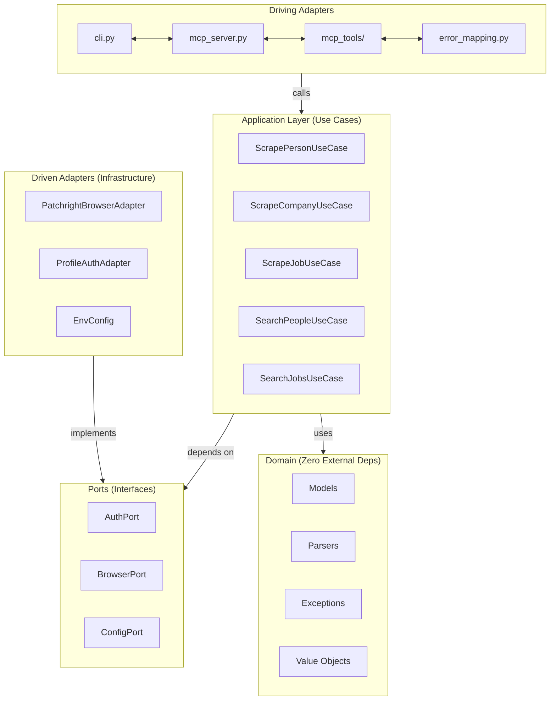

# Contributing

Thank you for your interest in contributing to **LinkedIn MCP Server**! Whether you're fixing a bug, adding a new scraping section, or improving documentation, this guide will help you get started quickly and ship with confidence.

---

## Table of Contents

- [Getting Started](#getting-started)
- [Project Structure](#project-structure)
- [Architecture Deep Dive](#architecture-deep-dive)
- [Development Workflow](#development-workflow)
- [How to Contribute](#how-to-contribute)
- [Step-by-Step Guides](#step-by-step-guides)
- [Commit Convention](#commit-convention)
- [Code Style Guidelines](#code-style-guidelines)
- [Testing](#testing)
- [Troubleshooting](#troubleshooting)
- [Community](#community)
- [License](#license)

---

## Getting Started

### Prerequisites

- **Python 3.12** or later
- [uv](https://docs.astral.sh/uv/) package manager
- A LinkedIn account (for running the server or integration tests)

### 1. Fork and clone

```bash
# Fork via GitHub UI, then:
git clone https://github.com/<your-username>/linkedin-mcp-server.git
cd linkedin-mcp-server
```

### 2. Install dependencies

This project uses [uv](https://docs.astral.sh/uv/) as its package manager. Install all dependencies including the dev group:

```bash
uv sync --group dev
```

<details>
<summary>What gets installed?</summary>

| Package | Purpose |
| --- | --- |
| `fastmcp` | MCP framework for tool registration and transport |
| `patchright` | Stealth browser automation (Playwright fork) |
| `beautifulsoup4` + `lxml` | HTML parsing |
| `python-dotenv` | `.env` file loading |
| `inquirer` | Interactive CLI prompts |
| `ruff` | Linting and formatting |
| `pytest` + `pytest-asyncio` + `pytest-cov` | Testing |
| `pre-commit` | Git hooks for code quality |

</details>

### 3. Set up pre-commit hooks

Pre-commit hooks enforce code quality checks (formatting, linting, trailing whitespace, etc.) on every commit:

```bash
uv run pre-commit install
```

The hooks include:

- **Ruff** — linting with auto-fix + formatting
- **Trailing whitespace** removal
- **End-of-file** fixer
- **YAML/TOML** syntax validation
- **Large file** guard (max 500 KB)
- **Merge conflict** marker detection
- **Debug statement** detection

### 4. Authenticate with LinkedIn

Required for running the server locally or running integration tests:

```bash
uv run linkedin-mcp-server --login
```

A browser window will open — log in to LinkedIn and the session will be persisted at `~/.linkedin-mcp-server/browser-data`.

> **Tip:** You can check your session status anytime with `uv run linkedin-mcp-server --status`, or clear stored credentials with `uv run linkedin-mcp-server --logout`.

---

## Project Structure

```
linkedin-mcp-server/
├── src/linkedin_mcp_server/
│   ├── domain/                  # Core logic — zero external dependencies
│   │   ├── models/              # Typed dataclass models
│   │   │   ├── person.py        # PersonMainProfile, ExperienceEntry, etc.
│   │   │   ├── company.py       # CompanyAbout, CompanyPostEntry, etc.
│   │   │   ├── job.py           # JobPostingDetail
│   │   │   ├── search.py        # PeopleSearchResults, JobSearchResults
│   │   │   └── responses.py     # ScrapeResponse wrapper
│   │   ├── parsers/             # HTML → structured data (pure functions)
│   │   │   ├── __init__.py      # Section registries + router
│   │   │   ├── common.py        # Shared helper utilities
│   │   │   ├── person.py        # Person profile parsers
│   │   │   ├── company.py       # Company profile parsers
│   │   │   ├── job.py           # Job posting parser
│   │   │   └── search.py        # Search results parsers
│   │   ├── exceptions.py        # Domain exception hierarchy
│   │   └── value_objects.py     # Immutable config and content objects
│   ├── ports/                   # Abstract interfaces (contracts)
│   │   ├── auth.py              # AuthPort
│   │   ├── browser.py           # BrowserPort
│   │   └── config.py            # ConfigPort
│   ├── application/             # Use cases — orchestration layer
│   │   ├── scrape_person.py     # ScrapePersonUseCase
│   │   ├── scrape_company.py    # ScrapeCompanyUseCase
│   │   ├── scrape_job.py        # ScrapeJobUseCase
│   │   ├── search_people.py     # SearchPeopleUseCase
│   │   ├── search_jobs.py       # SearchJobsUseCase
│   │   └── manage_session.py    # ManageSessionUseCase
│   ├── adapters/
│   │   ├── driven/              # Infrastructure implementations
│   │   │   ├── patchright_browser.py  # BrowserPort → Patchright
│   │   │   ├── profile_auth.py        # AuthPort → profile-based auth
│   │   │   └── env_config.py          # ConfigPort → .env / env vars
│   │   └── driving/             # Interface layer
│   │       ├── cli.py           # CLI entry point and argument parsing
│   │       ├── mcp_server.py    # FastMCP server setup
│   │       ├── mcp_tools/       # MCP tool registration modules
│   │       │   ├── person.py    # get_person_profile, search_people
│   │       │   ├── company.py   # get_company_profile, get_company_posts
│   │       │   ├── job.py       # get_job_details, search_jobs
│   │       │   └── session.py   # close_browser
│   │       ├── error_mapping.py # Domain exceptions → ToolError
│   │       └── serialization.py # Dataclass → JSON dict
│   └── container.py             # DI composition root
├── pyproject.toml               # Project config (deps, ruff, pytest)
├── .pre-commit-config.yaml      # Pre-commit hook definitions
├── .editorconfig                # Editor formatting rules
└── .gitignore
```

---

## Architecture Deep Dive

The project follows a **hexagonal (ports and adapters) architecture** with strict layer separation. Understanding this is essential for contributing quality code.

### Layer Diagram



### Architecture Rules

| Rule | Description |
| --- | --- |
| Domain has zero external deps | Domain code must **never** import from `adapters/`. It only uses stdlib and its own models. |
| Ports define contracts | They are abstract classes (`ABC`) in `ports/`. |
| Adapters implement ports | Concrete implementations live in `adapters/driven/` (infrastructure) and `adapters/driving/` (interface). |
| Use cases depend only on ports | Never on concrete adapters. Receive dependencies via constructor injection. |
| Container wires everything | `container.py` is the **single** place that imports and instantiates concrete adapter classes. |

### Data Flow

```
User Request → MCP Tool → Use Case → BrowserPort → HTML
                                          ↓
                              Parser (domain) → Typed Dataclass
                                          ↓
                              Serializer → JSON Response
```

### Exception Hierarchy

All domain exceptions derive from `LinkedInMCPError`. The `error_mapping.py` adapter translates them into user-friendly `ToolError` messages for MCP clients:

```
LinkedInMCPError
├── AuthenticationError
│   ├── CredentialsNotFoundError
│   └── SessionExpiredError
├── RateLimitError
├── ScrapingError
│   ├── ElementNotFoundError
│   └── ProfileNotFoundError
├── NetworkError
└── ConfigurationError
```

---

## Development Workflow

### Running the server locally

```bash
# stdio transport (default — for Claude Desktop, Cursor, etc.)
uv run linkedin-mcp-server

# HTTP transport with debug logging (for MCP Inspector, remote clients)
uv run linkedin-mcp-server --transport streamable-http --port 8000 --log-level DEBUG
```

### Using the MCP Inspector

The [MCP Inspector](https://github.com/modelcontextprotocol/inspector) is essential for manually testing tool changes:

```bash
npx @modelcontextprotocol/inspector
```

Connect to `http://localhost:8000/mcp` when using HTTP transport. This lets you invoke tools interactively and inspect the JSON responses.

### Running tests

```bash
# All unit tests
uv run pytest

# With coverage report
uv run pytest --cov=linkedin_mcp_server

# Skip integration tests (require real LinkedIn session)
uv run pytest -m "not integration"

# Run only slow tests
uv run pytest -m slow

# Verbose output for debugging
uv run pytest -v -s
```

### Linting and formatting

This project uses [Ruff](https://docs.astral.sh/ruff/) for both linting and formatting. Pre-commit hooks run these automatically, but you can also run them manually:

```bash
# Check for lint issues
uv run ruff check .

# Auto-fix lint issues
uv run ruff check . --fix

# Format code
uv run ruff format .

# Verify formatting (CI mode — no modifications)
uv run ruff format --check .
```

<details>
<summary>Ruff rules enabled</summary>

The project enforces the following [Ruff rule sets](https://docs.astral.sh/ruff/rules/) (configured in `pyproject.toml`):

| Code | Category |
| --- | --- |
| `E` | pycodestyle errors |
| `F` | Pyflakes |
| `I` | isort (import sorting) |
| `N` | pep8-naming |
| `W` | pycodestyle warnings |
| `UP` | pyupgrade (modern Python syntax) |
| `B` | flake8-bugbear |
| `SIM` | flake8-simplify |
| `RUF` | Ruff-specific rules |

Line length limit: **100 characters**. Target version: **Python 3.12**.

</details>

### Environment configuration

Create a `.env` file in the project root to customize behavior without CLI args:

```env
# Server
LINKEDIN_TRANSPORT=stdio
LINKEDIN_HOST=127.0.0.1
LINKEDIN_PORT=8000
LINKEDIN_LOG_LEVEL=DEBUG

# Browser
LINKEDIN_HEADLESS=true
LINKEDIN_SLOW_MO=0
LINKEDIN_TIMEOUT=10000
LINKEDIN_VIEWPORT_WIDTH=1280
LINKEDIN_VIEWPORT_HEIGHT=720
LINKEDIN_USER_DATA_DIR=~/.linkedin-mcp-server/browser-data
```

> **Precedence:** CLI args > environment variables > `.env` file > defaults

---

## How to Contribute

### Reporting Bugs

Open an [issue](https://github.com/eliasbiondo/linkedin-mcp-server/issues) with the following information:

- **Summary**: a clear, one-line description of the bug
- **Steps to reproduce**: numbered steps to trigger the issue
- **Expected vs. actual behavior**: what should happen vs. what happens
- **Environment**: OS, Python version, `uv --version` output
- **Logs**: relevant output with `--log-level DEBUG` if applicable
- **Screenshots or JSON output**: if the issue is about incorrect parsing

### Suggesting Features

Open an [issue](https://github.com/eliasbiondo/linkedin-mcp-server/issues) with:

- A clear description of the feature
- The use case — *why* it would be valuable
- Which architecture layer(s) would be affected
- Any implementation ideas (optional)

### Submitting Pull Requests

1. **Create a branch** from `main`:

   ```bash
   git checkout -b feat/my-feature
   ```

2. **Make your changes**, following the [architecture rules](#architecture-rules) above.

3. **Add tests** for new functionality where applicable.

4. **Verify all checks pass**:

   ```bash
   uv run ruff check .
   uv run ruff format --check .
   uv run pytest
   ```

5. **Commit** using a descriptive message following the [commit convention](#commit-convention).

6. **Push** and open a pull request against `main`.

#### Pull Request Checklist

- [ ] Branch is up-to-date with `main`
- [ ] Code follows the hexagonal architecture rules
- [ ] Domain code has zero external dependencies
- [ ] New models are Python `@dataclass` with `None` defaults
- [ ] Parsers handle missing elements gracefully (no unguarded exceptions)
- [ ] Tests pass (`uv run pytest`)
- [ ] Linting passes (`uv run ruff check .`)
- [ ] Formatting passes (`uv run ruff format --check .`)
- [ ] Commit messages follow [Conventional Commits](#commit-convention)
- [ ] Manually tested with the [MCP Inspector](#using-the-mcp-inspector) (for tool changes)

---

## Step-by-Step Guides

### Adding a New Person Profile Section

If you want to add a new profile section (e.g., certifications), follow these steps:

#### 1. Create the data model

Add your model to `domain/models/person.py`:

```python
@dataclass
class CertificationEntry:
    """A single certification entry."""

    name: str | None = None
    issuer: str | None = None
    credential_id: str | None = None
    issue_date: str | None = None
    expiry_date: str | None = None
    logo_url: str | None = None


@dataclass
class CertificationsSection:
    """Certifications section — extracted from /in/{username}/details/certifications/."""

    certifications: list[CertificationEntry] = field(default_factory=list)
    raw: str | None = None
```

> **Conventions:** All fields should be `str | None = None` (or list with `field(default_factory=list)`). Include an optional `raw: str | None = None` field for debug mode.

#### 2. Create the parser

Add the parser function to `domain/parsers/person.py`:

```python
def parse_certifications(html: str, *, include_raw: bool = False) -> CertificationsSection:
    """Parse certifications section HTML."""
    soup = _soup(html)
    entries: list[CertificationEntry] = []

    items = soup.find_all(
        "li",
        class_=lambda c: c and "pvs-list__paged-list-item" in c and "artdeco-list__item" in c,
    )

    for item in items:
        entity = item.find(
            "div", attrs={"data-view-name": "profile-component-entity"}, recursive=True,
        )
        if not entity:
            continue

        # Name — bold text
        name_el = entity.find("div", class_=lambda c: c and "t-bold" in c)
        name = _aria_hidden_text(name_el)

        # ... extract other fields using the same patterns ...

        entries.append(CertificationEntry(name=name, ...))

    return CertificationsSection(certifications=entries, raw=html if include_raw else None)
```

> **Important:** Parsers must be **defensive**. LinkedIn's HTML structure changes frequently. Always use `try/except` or null-safe access and return `None` for missing fields.

#### 3. Register the section and parser

In `domain/parsers/__init__.py`:

```python
# Add to PERSON_SECTIONS registry
PERSON_SECTIONS: dict[str, SectionConfig] = {
    # ... existing sections ...
    "certifications": SectionConfig("certifications", "/details/certifications/"),
}

# Add to _PERSON_PARSERS registry
_PERSON_PARSERS: dict[str, Any] = {
    # ... existing parsers ...
    "certifications": parse_certifications,
}

# Update the ParsedSection type alias
type ParsedSection = (
    # ... existing types ...
    | CertificationsSection
)
```

#### 4. Update the MCP tool description

In `adapters/driving/mcp_tools/person.py`, update the `get_person_profile` tool description to include the new section:

```python
"        Available sections: experience, education, interests, honors, "
"languages, contact_info, posts, certifications\n"
```

#### 5. Add tests

Create test cases for your parser. See the [Testing](#testing) section for patterns.

#### 6. Test manually

Use the MCP Inspector to test your new section end-to-end:

```bash
# Terminal 1: Start the server
uv run linkedin-mcp-server --transport streamable-http --port 8000 --log-level DEBUG

# Terminal 2: Open the Inspector
npx @modelcontextprotocol/inspector
```

Invoke `get_person_profile` with `sections: "certifications"` and verify the JSON response.

---

### Adding a New Company Section

The process mirrors the person section workflow:

1. **Model** → `domain/models/company.py`
2. **Parser** → `domain/parsers/company.py`
3. **Register** → `COMPANY_SECTIONS` and `_COMPANY_PARSERS` in `domain/parsers/__init__.py`
4. **Tool description** → `adapters/driving/mcp_tools/company.py`
5. **Tests** → parser unit tests

---

### Adding a New MCP Tool

If you're adding an entirely new tool (not just a new section):

#### 1. Create the use case

Add a new file in `application/`:

```python
class MyNewUseCase:
    """Describe what this use case does."""

    def __init__(self, browser: BrowserPort, auth: AuthPort, *, debug: bool = False):
        self._browser = browser
        self._auth = auth
        self._debug = debug

    async def execute(self, ...) -> ScrapeResponse:
        await self._auth.ensure_authenticated()
        # ... orchestrate browser + parser calls ...
```

#### 2. Wire it in the Container

Add the use case to `container.py`:

```python
self._my_new_uc = MyNewUseCase(self._browser, self._auth, debug=debug)

@property
def my_new_uc(self) -> MyNewUseCase:
    return self._my_new_uc
```

#### 3. Register the MCP tool

Create (or update) a tool registration module in `adapters/driving/mcp_tools/`:

```python
@mcp.tool(name="my_new_tool", description="...")
async def my_new_tool(..., ctx: Context) -> dict[str, Any]:
    try:
        result = await my_new_uc.execute(...)
        return {"url": result.url, "sections": serialize_sections(result.sections)}
    except Exception as e:
        map_domain_error(e, "my_new_tool")
```

#### 4. Register in the MCP server

Update `adapters/driving/mcp_server.py` to call your tool registration function.

---

## Commit Convention

This project follows [Conventional Commits](https://www.conventionalcommits.org/):

| Prefix | Description |
| --- | --- |
| `feat:` | A new feature |
| `fix:` | A bug fix |
| `docs:` | Documentation changes |
| `refactor:` | Code refactoring with no behavior change |
| `test:` | Adding or updating tests |
| `chore:` | Tooling, CI, or dependency updates |
| `style:` | Formatting, whitespace (non-functional changes) |
| `perf:` | Performance improvements |

### Examples

```
feat: add support for scraping certifications section
fix: handle rate-limited responses in job search
docs: update configuration reference in README
refactor: extract common parser helpers into shared module
test: add unit tests for education parser
chore: bump ruff to v0.12
```

### Scope (optional)

You can optionally include a scope for more precision:

```
feat(parsers): add certifications parser
fix(browser): handle timeout during slow page loads
refactor(domain): simplify experience date splitting
```

---

## Code Style Guidelines

### General

- **Type hints everywhere.** All function signatures must include type annotations.
- **Line length: 100 characters.** Enforced by Ruff.
- **Target: Python 3.12.** Use modern syntax (`str | None` instead of `Optional[str]`, etc.).
- **Keep PRs focused.** One feature or fix per pull request.

### Domain Layer

- **Models** are `@dataclass` classes with `None`-default fields. Every section model includes an optional `raw: str | None = None` field for debug mode.
- **Parsers are pure functions.** They take `html: str` and return a typed model. No side effects, no I/O.
- **Parsers must be defensive.** LinkedIn's HTML changes frequently — use guard clauses, null checks, and return `None` for missing fields rather than raising exceptions.
- **Exceptions** always derive from `LinkedInMCPError`. Add new exception types to `domain/exceptions.py`.

### Application Layer

- **Use cases** orchestrate the flow: authenticate → navigate → extract HTML → parse → return.
- **Only depend on ports**, never on concrete adapters. Inject dependencies through the constructor.
- Use `asyncio.sleep()` between consecutive requests to avoid rate-limiting.

### Adapter Layer

- **Driven adapters** implement port interfaces. They handle the real infrastructure concerns (browser, file system, env vars).
- **Driving adapters** expose the application to the outside world (CLI, MCP tools).
- The `error_mapping.py` module is the **only** place that translates domain exceptions to `ToolError`.
- The `serialization.py` module converts dataclass sections to JSON-serializable dicts.

### Parser Patterns

When writing parsers, use the established patterns from existing parsers:

```python
# Standard parser signature
def parse_my_section(html: str, *, include_raw: bool = False) -> MySectionModel:
    soup = _soup(html)  # BeautifulSoup with lxml parser
    entries = []

    # Find list items using LinkedIn's standard CSS classes
    items = soup.find_all(
        "li",
        class_=lambda c: c and "pvs-list__paged-list-item" in c and "artdeco-list__item" in c,
    )

    for item in items:
        # Find the entity container
        entity = item.find(
            "div", attrs={"data-view-name": "profile-component-entity"}, recursive=True,
        )
        if not entity:
            continue

        # Extract bold text (usually the title/name)
        title = _aria_hidden_text(entity.find("div", class_=lambda c: c and "t-bold" in c))

        entries.append(MyEntry(title=title))

    return MySectionModel(entries=entries, raw=html if include_raw else None)
```

---

## Testing

### Test Structure

Tests live in the `tests/` directory and mirror the source structure. The project uses [pytest](https://docs.pytest.org/) with the [pytest-asyncio](https://github.com/pytest-dev/pytest-asyncio) plugin.

### Configuration

From `pyproject.toml`:

```toml
[tool.pytest.ini_options]
testpaths = ["tests"]
asyncio_mode = "auto"
markers = [
    "integration: Integration tests requiring real infrastructure",
    "slow: Tests that take > 10 seconds",
]
```

### Test Types

| Type | Marker | Description |
| --- | --- | --- |
| Unit tests | *(none)* | Pure function tests (parsers, models, serialization) |
| Integration tests | `@pytest.mark.integration` | Require a real LinkedIn session and browser |
| Slow tests | `@pytest.mark.slow` | Tests that take > 10 seconds |

### Writing Parser Tests

Parser tests are the most common type. The pattern is:

```python
def test_parse_certifications_basic():
    html = """
    <li class="pvs-list__paged-list-item artdeco-list__item">
        <div data-view-name="profile-component-entity">
            <div class="t-bold">
                <span aria-hidden="true">AWS Solutions Architect</span>
            </div>
        </div>
    </li>
    """
    result = parse_certifications(html)
    assert len(result.certifications) == 1
    assert result.certifications[0].name == "AWS Solutions Architect"


def test_parse_certifications_empty():
    result = parse_certifications("<html></html>")
    assert result.certifications == []
    assert result.raw is None


def test_parse_certifications_raw_mode():
    html = "<html><body>test</body></html>"
    result = parse_certifications(html, include_raw=True)
    assert result.raw == html
```

### Running Specific Tests

```bash
# Run a specific test file
uv run pytest tests/test_parsers.py

# Run a specific test function
uv run pytest tests/test_parsers.py::test_parse_certifications_basic

# Run with keyword matching
uv run pytest -k "certification"
```

---

## Troubleshooting

### Common Issues

<details>
<summary><strong>Authentication fails or session expired</strong></summary>

Re-authenticate:

```bash
uv run linkedin-mcp-server --logout
uv run linkedin-mcp-server --login
```

If LinkedIn shows a CAPTCHA or verification challenge, complete it manually in the browser window.

</details>

<details>
<summary><strong>Parser returns None/empty for a field that should have data</strong></summary>

LinkedIn frequently changes their HTML structure. Run the server with `--log-level DEBUG` and check the raw HTML. The CSS class names or DOM structure for that field may have changed.

Tips:
- Inspect the page element in your browser's DevTools
- Compare the current HTML against the parser's CSS selectors
- Open an issue if you find a structural change

</details>

<details>
<summary><strong>Rate limit detected</strong></summary>

LinkedIn applies rate limits on scraping. The server detects this and raises a `RateLimitError`. Wait 5–10 minutes before retrying. Consider using `LINKEDIN_SLOW_MO` to add delays between requests:

```env
LINKEDIN_SLOW_MO=1000
```

</details>

<details>
<summary><strong>Pre-commit hooks fail on commit</strong></summary>

Run the fixes manually:

```bash
uv run ruff check . --fix
uv run ruff format .
```

Then stage and commit again.

</details>

<details>
<summary><strong>Browser not launching</strong></summary>

Ensure Patchright's browser is installed:

```bash
uv run patchright install chromium
```

If you're using a custom Chrome path, set the `LINKEDIN_CHROME_PATH` environment variable.

</details>

---

## Community

- **Issues:** [github.com/eliasbiondo/linkedin-mcp-server/issues](https://github.com/eliasbiondo/linkedin-mcp-server/issues)
- **Discussions:** Use GitHub Issues for questions, ideas, and general discussion

Please be respectful and constructive in all interactions. We're all here to build something useful together.

---

## License

By contributing, you agree that your contributions will be licensed under the [MIT License](LICENSE).
